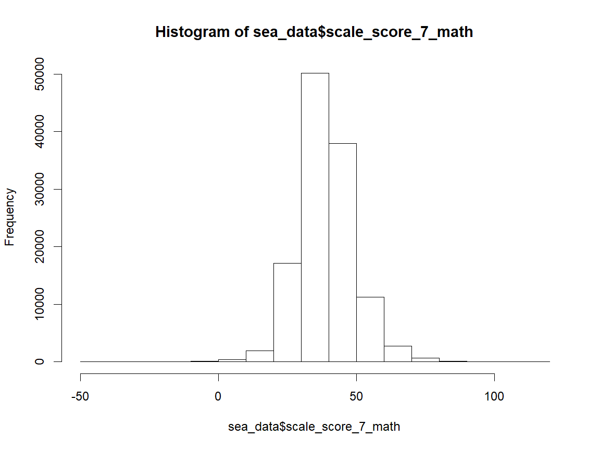
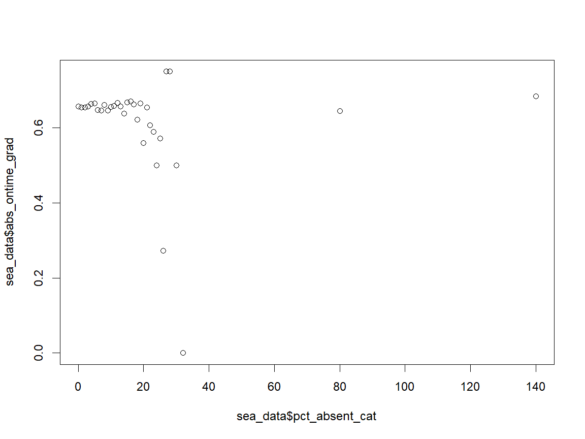
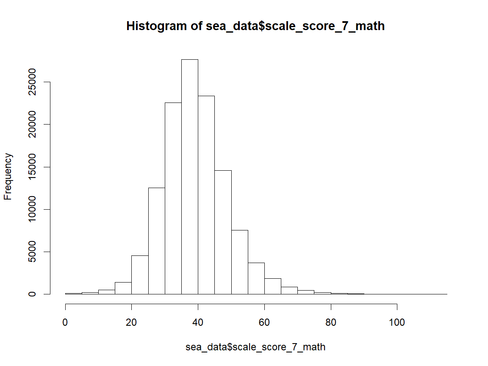
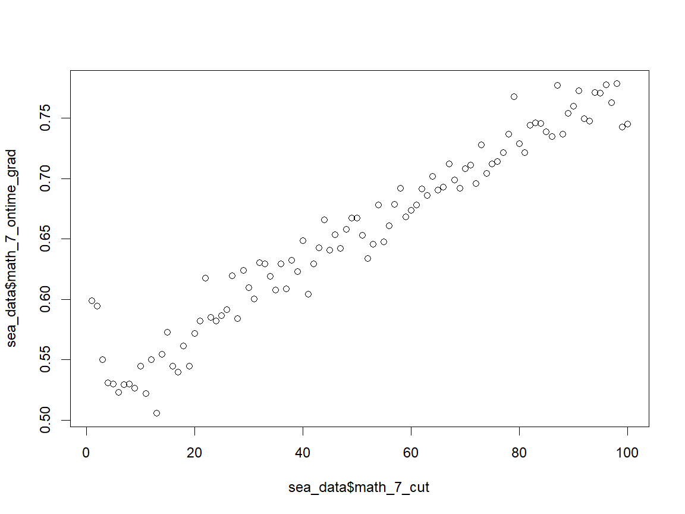
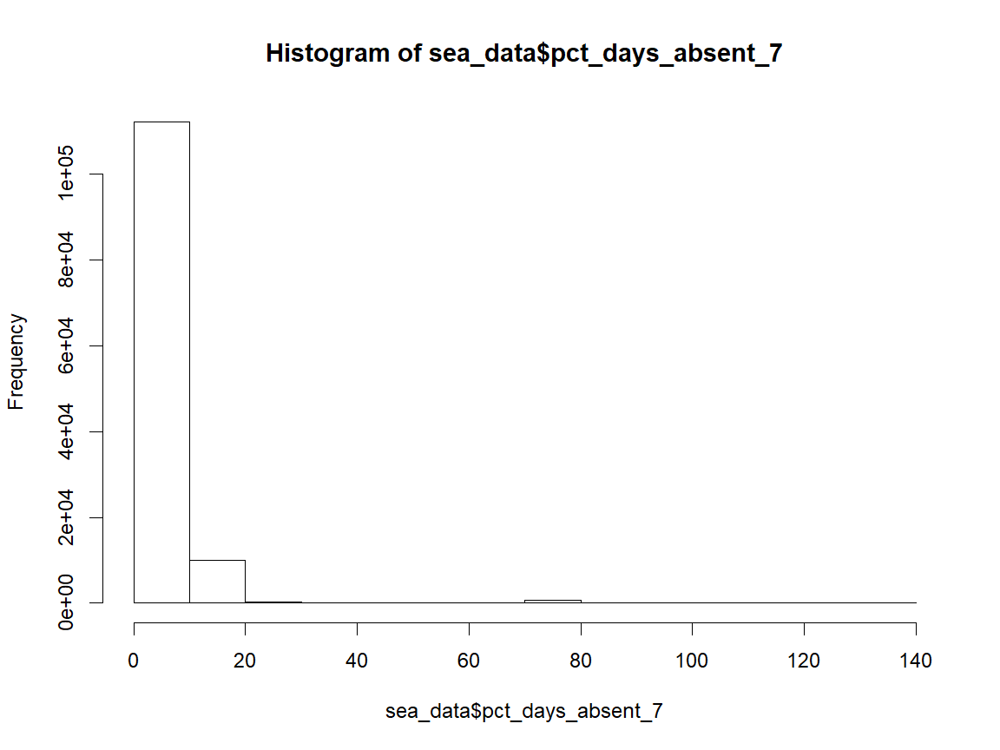
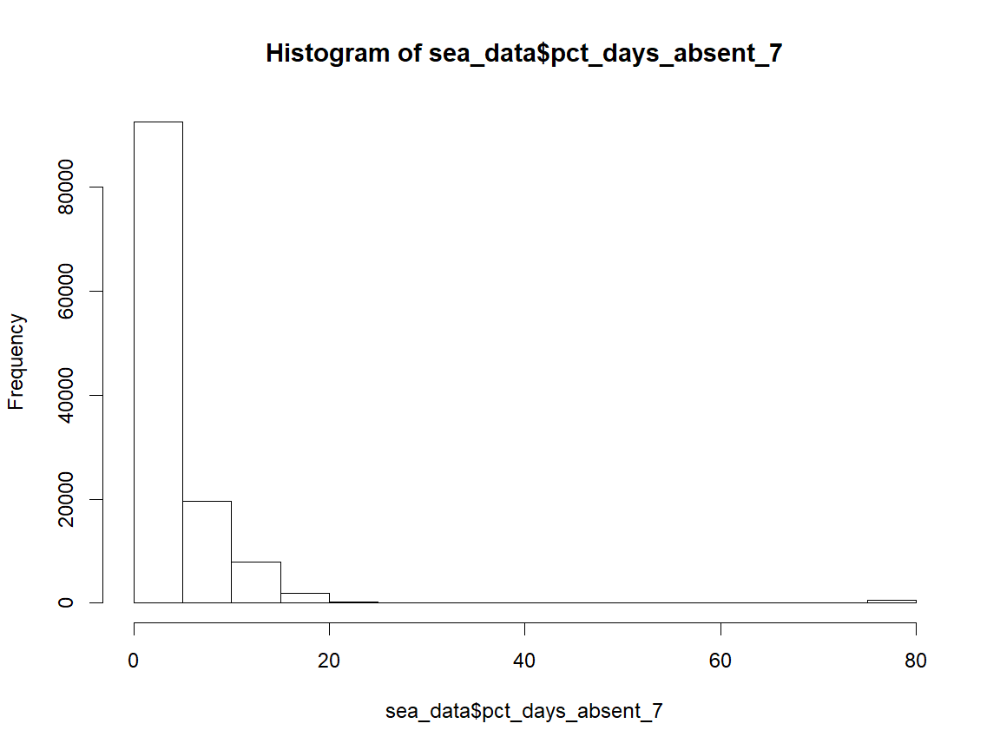
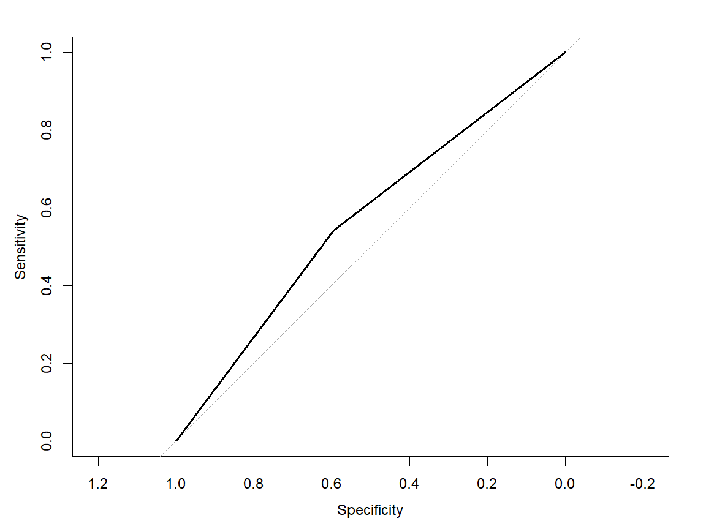
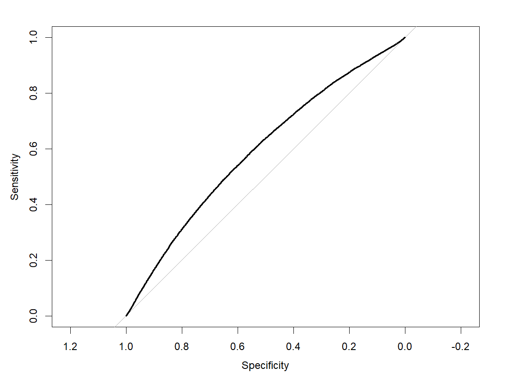

# Predictive Analytics in Education

<div class="navbar navbar-default navbar-fixed-top" id="logo">
<div class="container">

</div>
</div>

### Objective

After completing this guide, the user will be familiar with the most common 
principles and technique of predictive analytics and how they can be applied 
to education data analysis problems - particularly through the example of 
student "early warning indicators". 

### Using this Guide

This guide uses synthetic data created by the OpenSDP synthetic data engine.
The data reflects student-level attainment data and is organized to be similar 
to the level of detail available at a state education agency - with a single 
row representing a student-grade-year. This guide does not cover the steps 
needed to clean raw student data. If you are interested in how to assemble 
data like this or the procedure used to generate the data, the code used 
is included in the data subdirectory. 


## Introduction

For this guide, we will be building a model to predict on-time high school
graduation using 7th grade data. The problem definition phase is often the
most important when developing a predictive model, so when applying these
lessons to your own work consider the outcome to be predicted and the measures
available. You can learn more about the importance of data preparation
by reading this guide to EWS development.

This guide will provide you with a baseline model to introduce you to the main
concepts of predictive analytics. From there, you will learn techniques needed
to interpret, understand, and iteratively improve the model.

This guide demonstrates the techniques of predictive analytics using a synthetic
data set. The data in this guide were generated using the OpenSDP synthetic data
generator. The code to generate the data is available in the `data` directory.
The data are completely synthetic student-level records and are free to report
and distribute - no FERPA concerns here. The one caveat is that the relationships
between predictors and the outcome in the data may not be typical of the
relationships you would find in your local data set. In particular, there is
less room for model improvement in this synthetic data than is typical in observed
education data. But, for learning the ropes, it will suit us just fine!

## Outline

Here are the steps:

1. explore and validate the data
2. examine the relationship between predictors and outcomes
3. evaluate the predictive power of different variables and select predictors for your model
4. make predictions using logistic regression
5. convert the predicted probabilities into a 0/1 indicator
6. look at the effect of different probability cutoffs on prediction accuracy 
7. Survey advanced techniques for model comparison and model fitting

This guide will take you through these steps using a baseline model for
predicting graduation using student-level grade 7 records. While this guide
focuses on a predictive analytic approach, it is good when evaluating different
methods for predicting student outcomes to consider alternative approaches. For
example, you should consider the "checklist" approaches
created at the Chicago Consortium of School
Research (CCSR). With that "checklist" approach, you experiment with different
thresholds for your predictor variables, and combine them to directly predict
the outcome. This approach has the advantage of being easy to explain and
implement, but it might not yield the most accurate predictions. We won't
demonstrate that approach here, but we will show how to compare the predictive
power of different modeling approaches so that you can make an informed decision
about the trade offs between transparency and accuracy.

In this guide, we will start from a data set that has been prepared, but if you
are applying this to work in your organization, it's good to consider a few
questions about the prediction task before you pull together your data and start
fitting models. First off, take time to think about variables, time, and data
sets. The sooner in a student's academic trajectory you can make a prediction,
the sooner you can intervene -- but the less accurate your predictions will be.
What data, and specifically which variables, do you have available to make
predictions? What outcome are you trying to predict?

In the case of this guide, we are limiting our focus to using data available
at the end of grade 7 to predict outcomes at the end of high school. A critical
step in developing a predictive model is to identify the time points that
different measures are collected during the process you are predicting -- you
can't use data from the future to make predictions. If you're planning to use
your model to make predictions for students at the end of 11th grade, for
instance, and if most students take AP classes as seniors, you can't use data
about AP course-taking collected during senior year to predict the likelihood of
college enrollment, even if you have that data available for past groups of
students.

We're using multiple cohorts of middle-school students for the predictive
analytics task -- students who were seventh graders between 2007 and in 2011.
These are the cohorts for which we have access to reliable information on their
high school graduation status (late graduate, on time graduate, dropout,
transferred out, disappeared). For this guide you are being given the entire set
of data so that you can explore different ways of organizing the data across
cohorts. An example is that you may choose to explore your models and data using
the earlier cohort, and evaluate their performance on more recent cohorts.

One last point -- even though the data is synthetic, we have simulated missing data
for you. In the real world, you'll need to make predictions for every
student, even if you're missing data for that student which your model needs in
order to run. Just making predictions using a logistic regression won't be
enough. You'll need to use decision rules based on good data exploration and
your best judgment to predict and fill in outcomes for students where you have
insufficient data.

Along the way we'll introduce some key skills: 

- Iterating through variables using `for` loops
- Writing convenience functions as shortcuts to common tasks
- Making and interpreting confusion matrices
- Evaluating model prediction performance graphically (using `ggplot2`)


## Getting Started

If you're using the `Rmd` file version of these materials, start by saving a new
version of the file, so you can edit it without worrying about overwriting the
original. Then work through the file in RStudio by highlighting one or a few
command lines at a time, clicking the "execute" icon (or pressing
control-enter), and then looking at the results in the R console. Edit or add
commands as you wish.  If you're using a paper or PDF version of these
materials, just read on--the R output appears below each section of commands.

This guide is built using the data from the fictional state education agency of
Montucky. This data set includes simulated data for multiple cohorts of 7th
graders along with their corresponding high school outcomes. Each observation
(row) is a student, and includes associated information about the student's
demographics, academic performance in 7th grade, associated school and district
(in grade 7), last high school attended, and high school completion. For
additional details on the data elements that makeup the synthetic data, there is
a codebook available in the data sub-directory.

## Setup

To prepare for this project you will need to ensure that your R installation
has the necessary add-on packages and that you can read in the training data.


```r
# Install add-on packages needed
install.packages("dplyr") # this will update your installed version to align with
install.packages("pROC") # those in the tutorial
install.packages("caret") # for machine learning
install.packages("ggplot2") # for plotting
```


```r
# Load the packages you need
library(dplyr)
library(pROC)
library(ggplot2)

# Load the helper functions not in packages
source("../R/functions.R")

# Read in the data
# This command assumes that the data is in a folder called data, below your
# current working directory. You can check your working directory with the
# getwd() command, and you can set your working directory using the RStudio
# environment, or the setwd() command.

load("../data/montucky.rda")
```

## Explore the Data

### Uniqueness

Ensure that the data imported correctly.

First, check whether the the data is unique by student ID.


```r
nrow(sea_data) == n_distinct(sea_data$sid)
```

```
[1] FALSE
```

Wait, what is the issue here?


```r
table(sea_data$sid == sea_data$sid[[1]]) # test how many times the first sid appears
```

```

 FALSE   TRUE 
123743     45 
```

Why might our IDs be repeated 45 times? Let's look at how many LEAs we have in
our SEA data set:


```r
length(unique(sea_data$sch_g7_lea_id)) # test how many LEAs are in our data
```

```
[1] 45
```

We see that our student IDs are not unique by LEA. That's an easy enough
fix.


```r
nrow(sea_data) == n_distinct(sea_data$sid, sea_data$sch_g7_lea_id)
```

```
[1] TRUE
```

Let's append the LEA ID onto the student ID to make student IDs truly unique:


```r
sea_data$sid <- paste(sea_data$sid, sea_data$sch_g7_lea_id, sep = "-")
```


```r
nrow(sea_data) == n_distinct(sea_data$sid)
```

```
[1] TRUE
```

### Defining the Outcome

A key initial task in building an EWS is to identify the cohort membership of
students. When we build a predictive model need to identify two time points --
when we will be making the prediction, and when the outcome we are predicting
will be observed. In this case, we will be making the prediction upon receiving
the 7th grade data on students (at the end of 7th grade), and we will
be predicting their completion of high school.

Let's focus first on identifying the 7th grade year for each student. We have
three year variables, what is their relationship:


```r
table(sea_data$year)
```

```

 2001  2002  2003  2004  2005  2006  2007  2008  2009  2010  2011 
   10    91  5831 27466 34072 31210 23616  1267   215     9     1 
```

```r
table(sea_data$cohort_year)
```

```

 2003  2004  2005  2006  2007  2008  2009  2010  2011  2012  2013 
   10    91  5831 27466 34072 31210 23616  1267   215     9     1 
```

```r
table(sea_data$cohort_grad_year)
```

```

 2006  2007  2008  2009  2010  2011  2012  2013  2014  2015  2016 
   10    91  5831 27466 34072 31210 23616  1267   215     9     1 
```

From the data dictionary we know that the first year variable is the year
that corresponds with the student entering 7th grade (`year`). The `cohort_year`
variable defines the 9th grade cohort a student belongs to for measuring on-time
graduation. Finally, the `cohort_grad_year` is the year that the cohort a
student is a member of should graduate to be considered "on-time".

If a student graduates, their year of graduation is recorded as `year_of_graduation`.

The definition of graduation types is an important design decision for our
predictive analytic system. We have to set a time by which students are graduated
so we know whether to count them as graduating or not completing. The state of
Montucky uses a 4-year cohort graduation rate for most reporting, defining
on-time graduation as graduation within 4 years of entering high school. This
variable is defined as:


```r
table(sea_data$year_of_graduation == sea_data$cohort_grad_year)
```

```

FALSE  TRUE 
 1889 81087 
```

```r
table(sea_data$ontime_grad)
```

```

    0     1 
42701 81087 
```

This is an example of a business rule - it's a restriction on the definition
of the data we make so that we can consistently use the data. In this case, it
is necessary so we can definitively group students for the purposes of predicting
their outcomes. You could consider alternative graduation timelines, for example:


```r
table(sea_data$year_of_graduation <= sea_data$cohort_grad_year + 1)
```

```

FALSE  TRUE 
  211 82765 
```

What does this rule say? How is it different than the definition of on-time above?

### Structure and Geography

Now that we have a sense of the time structure of the data, let's look at
geography. How many high schools and how many districts are? What are those
regional education services coops?

We are going to be building a model for the an entire state, but stakeholders
may have questions about how the model works for particular schools, districts,
or regions. Let's practice exploring the data by these different geographies.


```r
length(unique(sea_data$first_hs_name))
```

```
[1] 297
```

```r
length(unique(sea_data$first_hs_lea_id))
```

```
[1] 46
```

```r
table(sea_data$coop_name_g7, useNA = "always")
```

```

     Angelea        Birch     Caldwell Cold Springs         Hope       Marvel 
       15725        13444        17385        15668        12629        14983 
     Monarch       Weston  Wintergreen         <NA> 
       12139        10131        11684            0 
```

For this exercise, districts in Montucky are organized into cooperative regions.
Cooperative regions are just groups of LEAs. It may be helpful to compare how
our model performs in a given school, LEA, or cooperative region to the rest of the
data in the state. As an example of this kind of analysis, select a specific
coop region and explore its data, drawing comparisons to the full data set. Which
districts are part of this coop region and how many students do they have?
Substitute different abbreviation codes for different coops and then replace the
`my_coop` variable below.


```r
my_coop <- sea_data$coop_name_g7[50] # select the coop for the 50th observation
# Which districts are in this coop and how many 7th graders do we have for each?
table(sea_data$sch_g7_lea_id[sea_data$coop_name_g7 == my_coop],
      useNA = "always")
```

```

  01  028  033  044   09 <NA> 
2499 2500 4996 2497 2491    0 
```

```r
# which schools?
table(sea_data$sch_g7_name[sea_data$coop_name_g7 == my_coop],
      useNA = "always")
```

```

       Adams        Adler        Allen        Baker       Bootes       Carmen 
         309          892           35           98          269           91 
     Chelsea     Chestnut      Coleman    Commander  Copper Cove  Cornerstone 
         196          365          235          170          389          654 
      Dalton     Danehill      Dogwood    Gail Hill   Greenfield      Hanover 
         859          150          146          198          146          444 
   Hawthorne     Hillside      Hoffman       Irving     Islander      Kennedy 
         140          285          227          115          305          380 
   Lakeshore        Lever     Majestic       Meadow     Meridian Milton South 
         184          155           60          305          156          903 
      Murphy     Oak Tree       Oriole         Park       Peyton      Prairie 
         195          236          159         1424          174           18 
     Rainbow  Reigh Count        Reyes      Ritchie      Sargent    Sea Glass 
         176          110          392          263          104          137 
    Sterling Stone Street       Tupelo   Valley Way    Van Dusen       Venice 
         302          171          179          253          180          628 
     Wallaby   Wellington  Whitebridge   Winchester   Woodpecker       Yawkey 
         143          110          151          124          126          367 
        <NA> 
           0 
```

### Student Subgroups

What student subgroups are we interested in? Let's start by looking at student
subgroups. Here's whether a student is male.


```r
table(sea_data$male, useNA="always")
```

```

    0     1  <NA> 
59696 62882  1210 
```

Here's a short for loop to look at one-way tabs of a lot of variables at once.


```r
for(i in c("male", "race_ethnicity", "frpl_7", "iep_7", "ell_7",
           "gifted_7")){
  print(i)
  print(table(sea_data[, i], useNA="always"))
}
```

Let's examine the distribution of student subgroups by geography. For this
command, we'll use the same looping syntax from above, which lets you avoid
repetition by applying commands to multiple variables at once. You can type
`?for` into the R console if you want to learn more about how to use loops in R.


```r
for(var in c("male", "race_ethnicity", "frpl_7", "iep_7", "ell_7",
           "gifted_7")){
  print(var)
  comparison_table <- table(sea_data$coop_name_g7, sea_data[, var], 
                            useNA = "always")
  comparison_table <- prop.table(comparison_table, 
                                 margin = 1) # convert table to row proportions use 2 for column
  print( # Have to print in a for loop
    round(
      comparison_table*100, digits = 3 # round the results
    )
  )
}
```

Now, let's look at high school outcomes. We won't examine them all, but you should.
Here's the on-time high school graduation outcome variable we looked at above:


```r
table(sea_data$ontime_grad, useNA = "always")
```

```

    0     1  <NA> 
42701 81087     0 
```

Wait! What if the data includes students who transferred out of state? That
might bias the graduation rate and make it too low, because those 7th graders
might show up as having dropped out.


```r
table(sea_data$transferout, useNA = "always")
```

```

     0      1   <NA> 
111281  12507      0 
```

```r
table(transfer = sea_data$transferout, grad = sea_data$ontime_grad, useNA = "always")
```

```
        grad
transfer     0     1  <NA>
    0    30194 81087     0
    1    12507     0     0
    <NA>     0     0     0
```

This is another case where we may want to consider a business rule. How should
students who transfer out be treated? We don't know whether they graduated
or not. Should they be excluded from the analysis? Coded as not completing?
The decision is yours, but it is important to consider all the possible high
school outcomes when building a model and how the model will treat them.

Let's look at the distribution of another outcome variable, `any_grad`, which
includes late graduation and on-time graduation by both geography and by
subgroup.


```r
# Let's look at another, more compact way of writing our loop over variables
sum_table <- table("Co-Op" = sea_data$coop_name_g7, 
          "any_grad" = sea_data$any_grad, useNA="always")
round(prop.table(sum_table, margin = 1)*100, digits = 2)


for(var in c("male", "race_ethnicity", "frpl_7", "iep_7", "ell_7",
           "gifted_7")){
  print(var)
  sum_table <- table(var = sea_data[, var], 
          "any_grad" = sea_data$any_grad, useNA="always")
  sum_table <- prop.table(sum_table, margin = 1)
  print(round(sum_table * 100, digits = 2))
}
```

### Review Existing Indicator

Model comparison is central to developing good predictive models. The data set
for this guide comes with predictions from a fictitious vendor, which as an
analyst your goal is to match or beat in terms of accuracy. This section of
the guide explains how you can review and evaluate the accuracy of a model
using only the predictions it provides.

First, let's check the format of the model predictions:


```r
summary(sea_data$vendor_ews_score)
```

```
   Min. 1st Qu.  Median    Mean 3rd Qu.    Max. 
0.05032 0.89332 0.95164 0.92004 0.97805 0.99977 
```

There are two things to notice about this vendor's prediction. First, instead of
classifying students, each student receives a predicted probability for
graduating. This is a common approach. Instead of saying a student will graduate
or not graduate, we can say what the probability is that each student will
graduate. A second thing to notice is that we have a prediction for every single 
student in the data - no missing values. We already know some students have 
missing data for some variables. Making predictions for all students is a really 
great feature, but it calls into question what data elements are being used to 
make those predictions and how accurate such predictions may be. 

#### Confusion Matrix

A standard way to interpret the accuracy of predictive models that are classifying 
cases into two categories is called a confusion matrix. This allows us to 
compare a binary prediction (will graduate, will not graduate) to the an 
observed binary outcome (did graduate, did not graduate). To use this technique 
we select a probability threshold, above which observations are classified in 
one category, and below which they fall into the other category. A good threshold 
to try at first is 0.5. We can create a prediction on the fly and build the 
confusion matrix using the code below:


```r
set_thresh <- 0.5

conf_count <- table(observed = sea_data$ontime_grad,
      pred = sea_data$vendor_ews_score > set_thresh)
conf_count
```

```
        pred
observed FALSE  TRUE
       0    31 42670
       1    14 81073
```

The diagonal of the matrix tells us which classifications we made correctly. In 
this case, we predicted and were correct that 31 students would not graduate 
on time. We also predicted correctly 81,073 students who graduated on-time. 
However, we incorrectly predicted that 42,670 students would graduate on-time, 
but they did not -- this is not a very good prediction. We also predicted 
14 students would not graduate, but they did wind up graduating. 

We'll look at several different ways of defining accuracy a little bit further 
below, but here we can see that we do a good job identifying most of the students 
who graduate on-time, but we do that by predicting almost everyone to graduate 
on-time, which is not a very useful analytic. 

So, using a threshold of 0.5 we can see the vendor model predicts almost 
everyone to graduate, which results in getting a lot of correct predictions 
of students who will graduate, but failing to identify very many students 
who are at risk. Let's look at another method for setting the threshold and 
review the resulting confusion matrix. 

A common approach is to set the threshold at the mean of the predicted 
probability. 


```r
set_thresh <- mean(sea_data$vendor_ews_score)

conf_count <- table(observed = sea_data$ontime_grad,
      pred = sea_data$vendor_ews_score > set_thresh)
conf_count
```

```
        pred
observed FALSE  TRUE
       0 20826 21875
       1 20867 60220
```

```r
# Create a proportion table and round for easier interpretation
round(prop.table(conf_count), digits = 3)
```

```
        pred
observed FALSE  TRUE
       0 0.168 0.177
       1 0.169 0.486
```

Doing this, we see that we identify many fewer students who graduate on-time 
but we in exchange we identify many more students who do not graduate on-time. 
For example, we identify 20,826 students who do not graduate on-time successfully 
as non-graduates. We failed to identify 21,875 additional students who did not 
graduate on-time. We falsely identified 20,867 students as likely to not graduate 
on-time, but who in fact do graduate on time. Finally, we identify 60,220 students 
to graduate on-time who do graduate on-time. 

All we have done is changed the our threshold for action from 0.5 to the mean 
of the predicted probability 
0.92. So, we can already see 
that how to interpret the accuracy of our predictors depends both on what we 
value for accuracy, and how we set our probability cutoff for our predicted 
probability. 

### Explore Possible Predictors

Now that we understand how the vendor's prediction model is working, let's turn to
identifying the predictors available for building an alternative model. Let's
examine the performance and behavioral variables that you can use as predictors.
These are mostly numerical variables, so you should use `summary()`, `hist()`,
and `table()` functions explore them. Here's some syntax for examining 7th grade
math scores. You can replicate and edit it to examine other potential predictors
and their distributions by different subgroups.


```r
summary(sea_data$scale_score_7_math)
```

```
   Min. 1st Qu.  Median    Mean 3rd Qu.    Max.    NA's 
 -42.26   32.73   38.50   39.09   44.71  110.51    1237 
```

```r
ggplot(sea_data) + aes(x = scale_score_7_math) + 
  geom_histogram(bins = 120) + theme_bw()
```



A quick way to explore variables by a category is to use the `by()` function. 


```r
# TODO: Replace this with a visualization
by(sea_data$scale_score_7_math, sea_data$coop_name_g7, FUN = mean,
   na.rm = TRUE)
```

```
sea_data$coop_name_g7: Angelea
[1] 40.26076
------------------------------------------------------------ 
sea_data$coop_name_g7: Birch
[1] 37.51467
------------------------------------------------------------ 
sea_data$coop_name_g7: Caldwell
[1] 37.73536
------------------------------------------------------------ 
sea_data$coop_name_g7: Cold Springs
[1] 40.29902
------------------------------------------------------------ 
sea_data$coop_name_g7: Hope
[1] 40.85334
------------------------------------------------------------ 
sea_data$coop_name_g7: Marvel
[1] 38.68512
------------------------------------------------------------ 
sea_data$coop_name_g7: Monarch
[1] 36.84879
------------------------------------------------------------ 
sea_data$coop_name_g7: Weston
[1] 38.87301
------------------------------------------------------------ 
sea_data$coop_name_g7: Wintergreen
[1] 40.84764
```

```r
by(sea_data$scale_score_7_math, sea_data$frpl_7, FUN = mean,
   na.rm = TRUE)
```

```
sea_data$frpl_7: 0
[1] 41.40213
------------------------------------------------------------ 
sea_data$frpl_7: 1
[1] 35.0435
------------------------------------------------------------ 
sea_data$frpl_7: 2
[1] 34.89737
------------------------------------------------------------ 
sea_data$frpl_7: 9
[1] 39.19554
```

After exploring the predictors themselves, a good next step is to explore their 
relationship to the outcome. Let's start with the relationship between on-time 
graduation and 7th grade math scores and the percent of days absent in 7th grade. 
A good way to do this is to compare the difference in the means between graduates 
and non-graduates. We can standardize this difference using the standard deviation, 
a measure that is known as an effect size. Comparing differences in terms of 
standard deviations gives us a good sense of how different graduates and 
non-graduates are from one another on key measures. To simplify this process, 
we can use the `effect_size_diff()` function from the `functions.R` script. Just 
pass two variables to this function - the first one you want to compare, and the 
second defining the groups you want to compare by.


```r
effect_size_diff(x = sea_data$scale_score_7_math, 
                 group_idx = sea_data$ontime_grad, 
                 na.rm = TRUE)
```

```
[1] 0.2901296
```

```r
effect_size_diff(x = sea_data$pct_days_absent_7, 
                 group_idx = sea_data$ontime_grad, 
                 na.rm = TRUE)
```

```
[1] -0.003474914
```

We can see that math scores differentiate graduates and non-graduates in these 
data, but the two groups are nearly identical in terms of their attendance rates. 

It can be helpful at this point to visually inspect these differences as well. 
But you can't make a meaningful scatterplot when the independent, or y value, is
a binary outcome variable (try it!). Let's look at a technique to identify
the relationship between a continuous variable and a binary outcome.

The idea behind this code is to show the mean of the outcome variable for each
value of the predictor, or for categories of the predictor variable if it has
too many values. First, define categories (in this case, round to the nearest
percentage) of the percent absent variable, and then truncate the variable so that
low-frequency values are grouped together.


```r
sea_data$pct_absent_cat <- round(sea_data$pct_days_absent_7, digits = 0)
table(sea_data$pct_absent_cat)
```

```

    0     1     2     3     4     5     6     7     8     9    10    11    12 
62131  7311  7082  6876  6201  3000  5596  4867  4173  3533  1473  2625  2043 
   13    14    15    16    17    18    19    20    21    22    23    24    25 
 1574  1199   496   748   533   372   244    77   124    66    56    30     7 
   26    27    28    30    32    80   140 
   11     4     4     2     1   602   120 
```

```r
sea_data$pct_absent_cat[sea_data$pct_absenct_cat >= 30] <- 30
```

Next, define a variable which is the average on-time graduation rate for each
absence category, and then make a scatter plot of average graduation rates by
absence percent. As in previous guides, we'll use `ggplot` to make our graphs.


```r
plotdf <- sea_data %>%
  group_by(pct_absent_cat) %>% # perform the operation for each value
  summarize(abs_ontime_grad = mean(ontime_grad, na.rm = TRUE)) %>% # add a new variable
  as.data.frame() 

ggplot(plotdf, aes(x = pct_absent_cat, y = abs_ontime_grad)) + 
  geom_point() + theme_bw()
```



You can do the same thing for 7th grade test scores. First look at the math
test score and notice that some scores appear to be outliers. Let's correct 
math score values less than 0. 


```r
ggplot(sea_data) + aes(scale_score_7_math) +
  geom_histogram(bins = 100) + theme_bw()
```


```r
sea_data$scale_score_7_math[sea_data$scale_score_7_math < 0] <- NA
ggplot(sea_data) + aes(scale_score_7_math) +
  geom_histogram(bins = 100) + theme_bw()
```



You can do the same plot as above now by modifying the `group_by()`
command.


```r
plotdf <- sea_data %>%
  mutate(math_7_cut = ntile(scale_score_7_math, n = 100)) %>%
  group_by(math_7_cut) %>% # perform the operation for each value
  summarize(math_7_ontime_grad = mean(ontime_grad, na.rm=TRUE)) %>% # add a new variable
  as.data.frame()
  
ggplot(plotdf) + aes(x = math_7_cut, y = math_7_ontime_grad) + 
  geom_point() + 
  theme_bw()
```



This is a neat trick you can use to communicate your model predictions as well 
which we will use again below. 

### Missingness

Finally, here's some sample code you can use to look at missingness patterns in
the data. Note we use the `is.na()` function to test whether a value is missing.


```r
for(var in c("coop_name_g7", "male", "race_ethnicity")){
  print(var)
  sum_table <- table(sea_data[, var], 
                     "missing_math" = is.na(sea_data$pct_days_absent_7))
  sum_table <- prop.table(sum_table, 1)
  print(round(sum_table, digits = 3))
}
```

```
[1] "coop_name_g7"
              missing_math
               FALSE  TRUE
  Angelea      0.996 0.004
  Birch        0.996 0.004
  Caldwell     0.995 0.005
  Cold Springs 0.995 0.005
  Hope         0.995 0.005
  Marvel       0.995 0.005
  Monarch      0.994 0.006
  Weston       0.994 0.006
  Wintergreen  0.995 0.005
[1] "male"
   missing_math
    FALSE  TRUE
  0 0.995 0.005
  1 0.995 0.005
[1] "race_ethnicity"
           missing_math
            FALSE  TRUE
  Americ... 0.994 0.006
  Asian     0.994 0.006
  Black ... 0.995 0.005
  Demogr... 0.995 0.005
  Hispan... 0.996 0.004
  Native... 0.998 0.002
  White     0.995 0.005
```

Handling missing values is another case where business rules will come into play.

Did you see any outlier or impossible values while you were exploring the data?
If so, you might want to truncate them or change them to missing. Here's how you
can replace a numeric variable with a missing value if it is larger than a
certain number (in this case, 100 percent).


```r
ggplot(sea_data) + aes(x = pct_days_absent_7) + 
  geom_histogram(bins = 100) + theme_bw()
```



```r
sea_data$pct_days_absent_7[sea_data$pct_days_absent_7 > 100] <- NA
ggplot(sea_data) + aes(x = pct_days_absent_7) + 
  geom_histogram(bins = 100) + theme_bw()
```



Trimming the data in this way is another example of a business rule. You
may wish to trim the absences even further in this data. You may also wish to
assign a different value other than missing for unusual values - such as the
mean or median value.

## Model

Now that we've explored the data and looked at some relationships between
potential  predictors and our outcome of interest, we're ready to fit a logistic
regression.  In R, we use the `glm()` function to fit a logistic regression.
When you run a logistic regression, R calculates the parameters of an equation
that fits the relationship between the predictor variables and the outcome. A
regression model won't be able to explain all of the variation in an outcome
variable--any variation that is left over is treated as unexplained noise in the
data, or error, even if there are additional variables not in the model which
could explain more of the variation. Note that R will drop any rows in the data 
with a missing value in either the outcome or the key predictor - so it's a good 
idea to analyze the missingness patterns in your data to know what to expect: 


```r
# Count NAs
sum(is.na(sea_data$ontime_grad))
```

```
[1] 0
```

```r
sum(is.na(sea_data$scale_score_7_math))
```

```
[1] 1354
```

Fitting a logistic regression is a matter of passing a formula and a dataset to 
the R `glm()` function. Using a formula, we define our dependent variable / outcome on the 
left hand side of the formula (to the left of `~`), and our predictors are specified on 
the right hand side. Note that when writing formulas we do not have to put our variable 
names in quotations. 


```r
math_model <- glm(ontime_grad ~ scale_score_7_math, data = sea_data,
                  family = "binomial") # family tells R we want to fit a logistic
```

### Baseline Model

Once you've run a logistic regression, you can have R generate a variable with new,
predicted outcomes for each observation in your data with the `predict()` function.
The predictions are calculated using the model equation and ignore the
unexplained noise in the data. For logistic regressions, the predicted outcomes
take the form of a probability ranging 0 and 1. To start with, let's do a
regression of on-time graduation on seventh grade math scores.


The default summary output for logistic regression in R is not very helpful for
predictive modeling purposes.


```r
summary(math_model)
```

```

Call:
glm(formula = ontime_grad ~ scale_score_7_math, family = "binomial", 
    data = sea_data)

Deviance Residuals: 
    Min       1Q   Median       3Q      Max  
-2.3833  -1.3617   0.8346   0.9396   1.4221  

Coefficients:
                     Estimate Std. Error z value Pr(>|z|)    
(Intercept)        -0.5593845  0.0252679  -22.14   <2e-16 ***
scale_score_7_math  0.0310615  0.0006426   48.34   <2e-16 ***
---
Signif. codes:  0 '***' 0.001 '**' 0.01 '*' 0.05 '.' 0.1 ' ' 1

(Dispersion parameter for binomial family taken to be 1)

    Null deviance: 157769  on 122433  degrees of freedom
Residual deviance: 155302  on 122432  degrees of freedom
  (1354 observations deleted due to missingness)
AIC: 155306

Number of Fisher Scoring iterations: 4
```

Even before you use the predict command, you can use the logistic output to
learn something about the relationship between the predictor and the outcome
variable. The Pseudo $R^{2}$ (read: pseudo R-squared) is a proxy for the share
of variation in the outcome variable that is explained by the predictor.
Statisticians don't like it when you take the pseudo $R^{2}$ too seriously, but
it can be useful in predictive exercises to quickly get a sense of the
explanatory power of variables in a logistic model. You can use the function
`logit_rsquared()` in the `R/functions.R` file included with this guide to
calculate this for your model.


```r
logit_rsquared(math_model)
```

```
[1] 0.01563745
```

### Extend the Model

We want to increase the pseudo $R^{2}$ using the data we have, so we should
think about what additional information we have available that could inform
our prediction of student graduation.

One place to start is to consider that the relationship between math scores and
graduation may not be linear. We can evaluate this by looking at whether or not
adding polynomial terms increase the pseudo $R^{2}$? 

You can use the formula interface in R to add transformations of 
predictors without generating new variables and find out. In a formula, additive 
predictors are connected together by the `+` sign. To create polynomial terms, 
use the `I()`function to make the polynomial term in place - e.g. `I(scale_score_7_math^2)` 
is equivalent to creating a new variable - the square of `scale_score_7_math`. 


```r
math_model2 <- glm(ontime_grad ~ scale_score_7_math +
                     I(scale_score_7_math^2) + 
                     I(scale_score_7_math^3),
                   data = sea_data,
                  family = "binomial") # family tells R we want to fit a logistic
logit_rsquared(math_model2)
```

```
[1] 0.01758691
```

The model did not improve very much by adding the polynomial terms. Any time 
you add predictors to a model, the $R^{2}$ will increase, even if the variables 
are fairly meaningless, so it's best to focus on including predictors that add 
meaningful explanatory power.

Now take a look at the $R^{2}$ for a model with the absence variable.


```r
absence_model <- glm(ontime_grad ~ pct_days_absent_7, data = sea_data,
                  family = "binomial")
summary(absence_model)
```

```

Call:
glm(formula = ontime_grad ~ pct_days_absent_7, family = "binomial", 
    data = sea_data)

Deviance Residuals: 
    Min       1Q   Median       3Q      Max  
-1.4602  -1.4583   0.9188   0.9196   0.9473  

Coefficients:
                    Estimate Std. Error z value Pr(>|z|)    
(Intercept)        0.6439866  0.0066747  96.482   <2e-16 ***
pct_days_absent_7 -0.0009416  0.0008659  -1.087    0.277    
---
Signif. codes:  0 '***' 0.001 '**' 0.01 '*' 0.05 '.' 0.1 ' ' 1

(Dispersion parameter for binomial family taken to be 1)

    Null deviance: 158586  on 123060  degrees of freedom
Residual deviance: 158585  on 123059  degrees of freedom
  (727 observations deleted due to missingness)
AIC: 158589

Number of Fisher Scoring iterations: 4
```

```r
logit_rsquared(absence_model)
```

```
[1] 7.424679e-06
```

Notice two things - first our model does not fit the data very well! Second, this model 
has fewer observations deleted due to missingness. 

Let's combine our two predictors and test their combined power.


```r
combined_model <- glm(ontime_grad ~ pct_days_absent_7 + scale_score_7_math,
                      data = sea_data, family = "binomial")
summary(combined_model)
```

```

Call:
glm(formula = ontime_grad ~ pct_days_absent_7 + scale_score_7_math, 
    family = "binomial", data = sea_data)

Deviance Residuals: 
    Min       1Q   Median       3Q      Max  
-2.3868  -1.3614   0.8344   0.9397   1.4224  

Coefficients:
                     Estimate Std. Error z value Pr(>|z|)    
(Intercept)        -0.5601099  0.0255152 -21.952   <2e-16 ***
pct_days_absent_7  -0.0008865  0.0008804  -1.007    0.314    
scale_score_7_math  0.0311488  0.0006446  48.325   <2e-16 ***
---
Signif. codes:  0 '***' 0.001 '**' 0.01 '*' 0.05 '.' 0.1 ' ' 1

(Dispersion parameter for binomial family taken to be 1)

    Null deviance: 156860  on 121716  degrees of freedom
Residual deviance: 154393  on 121714  degrees of freedom
  (2071 observations deleted due to missingness)
AIC: 154399

Number of Fisher Scoring iterations: 4
```

```r
logit_rsquared(combined_model)
```

```
[1] 0.01572911
```

Using this combined model, let's use the predict command to make our first
predictions.


```r
sea_data$grad_pred <- predict(combined_model, newdata = sea_data,
                   type = "response") # this tells R to give us a probability
```

This generates a new variable with the probability of on-time high school
graduation, according to the model. But if you look at the number of
observations with predictions, you'll see that it is smaller than the total
number of students. This is because R doesn't use observations that have
missing data for any of the variables in the data. This is important to keep 
in mind when we are making predictions - if we want to handle missing data 
we have to do it in the data before we start applying model predictions 
to it. 


```r
table(is.na(sea_data$grad_pred))
```

```

 FALSE   TRUE 
121717   2071 
```

Let's convert this probability to a 0/1 indicator for whether or not a student
is likely to graduate on-time. A good rule of thumb when starting out is to set
the probability cutoff at the mean of the outcome variable. In this example,
we can store this value as a variable:


```r
basic_thresh <- mean(sea_data$ontime_grad)
basic_thresh
```

```
[1] 0.6550473
```

If the probability in the model is equal to or
greater than this threshold, we'll say the student is likely to graduate.


```r
sea_data$grad_indicator <- ifelse(sea_data$grad_pred > basic_thresh, 1, 0)
table(sea_data$grad_indicator, useNA = "always")
```

```

    0     1  <NA> 
61793 59924  2071 
```

You can also plot the relationship between the probability and the outcome.
Ideally, you should see the proportion of graduates steadily increase for each
percentile of the probabilities. What does this relationship tell you?


```r
plotdf <- sea_data %>%
  mutate(grad_pred_cut = ntile(grad_pred, n = 100)) %>%
  group_by(grad_pred_cut) %>% # perform the operation for each value
  summarize(grad_pred_cut_grad = mean(ontime_grad, na.rm=TRUE)) # add a new variable

ggplot(plotdf) + aes(x = grad_pred_cut, y = grad_pred_cut_grad) + 
  geom_point() + 
  theme_bw() 
```


### Measure Model Accuracy

Using an indicator like $R^{2}$ only tells us how the model fits the data. Fit 
to the data does not tell us what we'd really like to know for our model - how 
well will it predict future data. This is what we mean when we discuss model 
accuracy. 

Lets evaluate the accuracy of the model by comparing the predictions to the
actual graduation outcomes for the students for whom we have predictions. This
type of cross tab is called a "confusion matrix." The observations in the upper
right corner, where the indicator and the actual outcome are both 0, are true
negatives. The observations in the lower right corner, where the indicator and
the outcome are both 1, are true positives. The upper right corner contains
false positives, and the lower left corner contains false negatives. Overall, if
you add up the cell percentages for true positives and true negatives, the model
got 56.1 percent of the predictions right.

We will be making *a lot* of confusion matrices, so let's make a short function to 
make our job easier. This has the benefit of showing you how to write functions 
to avoid repetitious code for tasks you do a lot:


```r
conf_table <- function(observed, predicted, useNA = "no") { # give the function a name, and define the parameters
  # setting a parameter value = to something in the definition defines its default
  sum_table <- table(observed = observed, predicted = predicted, useNA = useNA)
  sum_table <- prop.table(sum_table)
  round(sum_table, 3)
  }

conf_table(sea_data$ontime_grad, sea_data$grad_indicator)
```

```
        predicted
observed     0     1
       0 0.207 0.138
       1 0.301 0.354
```

However, most of the wrong predictions are false negatives -- these are
students who have been flagged as dropout risks even though they
did graduate on-time. If you want your indicator system to be have fewer false
negatives, you can change the probability cutoff. This cutoff has a lower share
of false positives and a higher share of false negatives, with a somewhat lower
share of correct predictions.

Using our new function `conf_table()` we can quickly look at the confusion matrix 
for different thresholds of the predicted probabiliy. 


```r
new_thresh <- basic_thresh - 0.05
conf_table(sea_data$ontime_grad, sea_data$grad_pred > new_thresh)
```

```
        predicted
observed FALSE  TRUE
       0 0.097 0.248
       1 0.118 0.537
```

Note that this table only includes the complete cases. To look at missing values
as well:


```r
conf_table(sea_data$ontime_grad, sea_data$grad_pred > new_thresh, useNA = "always")
```

```
        predicted
observed FALSE  TRUE  <NA>
    0    0.095 0.244 0.006
    1    0.116 0.528 0.011
    <NA> 0.000 0.000 0.000
```

This table tells us that of our observations that have missing data for their 
predictors, more of them graduate than don't. 

## Missing Data

Another key business rule is how we will handle those students with missing data. A
predictive analytics system is more useful if it makes an actionable prediction
for every student. It is good to check, if it is available, the graduation rates
for students with missing data:


```r
# TODO - rewrite these 
table(Grad = sea_data$ontime_grad,
      miss_math = is.na(sea_data$scale_score_7_math)) %>% 
  prop.table(2) %>%  # get proportions by columns
  round(3) # round
```

```
    miss_math
Grad FALSE  TRUE
   0 0.345 0.340
   1 0.655 0.660
```

```r
table(Grad = sea_data$ontime_grad,
      miss_abs = is.na(sea_data$pct_days_absent_7)) %>% 
  prop.table(2) %>% # get proportions by columns
  round(3) # round
```

```
    miss_abs
Grad FALSE  TRUE
   0 0.345 0.326
   1 0.655 0.674
```

Students with missing data graduate at a slightly higher rate than students with
full data. There are a number of options at this point. One is to run a model
with fewer variables for only those students, and then use that model to fill in
the missing indicators.


```r
absence_model <- glm(ontime_grad ~ pct_days_absent_7,
                     data = sea_data[is.na(sea_data$scale_score_7_math),],
                     family = "binomial")
```


```r
sea_data$grad_pred_2 <- predict(absence_model, newdata = sea_data,
                                  type = "response")
summary(absence_model)
```

```

Call:
glm(formula = ontime_grad ~ pct_days_absent_7, family = "binomial", 
    data = sea_data[is.na(sea_data$scale_score_7_math), ])

Deviance Residuals: 
    Min       1Q   Median       3Q      Max  
-1.4793  -1.4579   0.9030   0.9101   1.1779  

Coefficients:
                   Estimate Std. Error z value Pr(>|z|)    
(Intercept)        0.686533   0.064396  10.661   <2e-16 ***
pct_days_absent_7 -0.008597   0.008193  -1.049    0.294    
---
Signif. codes:  0 '***' 0.001 '**' 0.01 '*' 0.05 '.' 0.1 ' ' 1

(Dispersion parameter for binomial family taken to be 1)

    Null deviance: 1725.8  on 1343  degrees of freedom
Residual deviance: 1724.7  on 1342  degrees of freedom
  (10 observations deleted due to missingness)
AIC: 1728.7

Number of Fisher Scoring iterations: 4
```


```r
table(sea_data$grad_indicator, useNA="always")
```

```

    0     1  <NA> 
61793 59924  2071 
```

```r
sea_data$grad_indicator[is.na(sea_data$grad_pred) &  
                            sea_data$grad_pred_2 < new_thresh] <- 0
sea_data$grad_indicator[is.na(sea_data$grad_pred) &  
                            sea_data$grad_pred_2 >= new_thresh] <- 1
table(sea_data$grad_indicator, useNA="always")
```

```

    0     1  <NA> 
61799 61262   727 
```

We now have predictions for all but a very small share of students, and those
students are split between graduates and non-graduates. We have to apply a rule
or a model to make predictions for them--we can't use information from the
future, except to develop the prediction system. We'll arbitrarily decide to
flag them as potential non-graduates, since students with lots of missing data
might merit some extra attention.


```r
table(sea_data$grad_indicator, sea_data$ontime_grad, useNA = "always")
```

```
      
           0     1  <NA>
  0    25180 36619     0
  1    17284 43978     0
  <NA>   237   490     0
```

```r
sea_data$grad_indicator[is.na(sea_data$grad_indicator)] <- 0
```

## Evaluate Fit

Now we have a complete set of predictions from our simple models. How well does
the prediction system work? Can we do better?


```r
conf_table(sea_data$ontime_grad, sea_data$grad_indicator)
```

```
        predicted
observed     0     1
       0 0.205 0.140
       1 0.300 0.355
```

A confusion matrix is one way to evaluate the success of a model and evaluate
trade offs as you are developing prediction systems. In cases like this,
where we have an uneven proportion of cases in each class (e.g. we have many more graduates than non-graduates),
it can be helpful to look at a metric like the AUC, which stands for "area under the
curve." The curve here refers to the receiver-operator characteristic, a
[statistic developed in the field of signal detection theory during WWII](https://en.wikipedia.org/wiki/Receiver_operating_characteristic#History).  
This metric allows you to explicitly weigh the trade-off in identifying a higher
proportion of an event (e.g. non-graduations) against the additional
false-positives (declaring students who will graduate as non-graduates) it will
cost to achieve that.

To understand this, let's first, look at row percentages instead of cell
percentages in the confusion matrix.


```r
table(Observed = sea_data$ontime_grad, Predicted = sea_data$grad_indicator) %>%
  prop.table(margin = 1) %>% round(3)
```

```
        Predicted
Observed     0     1
       0 0.595 0.405
       1 0.458 0.542
```

Next, use the `roc()` function to plot the true positive rate (sensitivity in
the graph) against the false positive rate (1-specificity in the graph).


```r
roc(sea_data$ontime_grad, sea_data$grad_indicator) %>% plot
```



You can also calculate ROC on the continuous predictor as well, to help you
determine the threshold:


```r
roc(sea_data$ontime_grad, sea_data$grad_pred) %>% plot
```



You can also calculate the numeric summaries instead of just the graphs. To
do this let's use the `caret` package:


```r
library(caret)
# We must wrap these each in calls to factor because of how this function expects
# the data to be formatted
caret::confusionMatrix(factor(sea_data$grad_indicator),
                       factor(sea_data$ontime_grad), positive = "1")
```

```
Confusion Matrix and Statistics

          Reference
Prediction     0     1
         0 25417 37109
         1 17284 43978
                                          
               Accuracy : 0.5606          
                 95% CI : (0.5578, 0.5634)
    No Information Rate : 0.655           
    P-Value [Acc > NIR] : 1               
                                          
                  Kappa : 0.124           
                                          
 Mcnemar's Test P-Value : <2e-16          
                                          
            Sensitivity : 0.5424          
            Specificity : 0.5952          
         Pos Pred Value : 0.7179          
         Neg Pred Value : 0.4065          
             Prevalence : 0.6550          
         Detection Rate : 0.3553          
   Detection Prevalence : 0.4949          
      Balanced Accuracy : 0.5688          
                                          
       'Positive' Class : 1               
                                          
```

A couple of last thoughts and notes. First, note that so far we haven't done any out-of-sample
testing. We should never trust our model fit measures on data the model was fit to -- statistical
models are overly confident. To combat this, you should subdivide your data set. There are many
strategies you can choose from depending on how much data you have and the nature of your problem -
for the EWS case, we can use the first two cohorts to build our models and the latter two cohorts to
evaluate that fit.

Here is some code you can use to do that:


```r
# In R we can define an index of rows so we do not have to copy our data
train_idx <- row.names(sea_data[sea_data$year %in% c(2003, 2004, 2005),])
test_idx <- !row.names(sea_data) %in% train_idx

fit_model <- glm(ontime_grad ~ scale_score_7_math + frpl_7,
                 data = sea_data[train_idx, ], family = "binomial")

sea_data$grad_pred_3 <- predict(fit_model, newdata = sea_data, type = "response")
summary(sea_data$grad_pred_3)
```

```
   Min. 1st Qu.  Median    Mean 3rd Qu.    Max.    NA's 
 0.2852  0.6131  0.6558  0.6550  0.6974  0.9401    1354 
```

```r
# Check the test index only
summary(sea_data$grad_pred_3[test_idx])
```

```
   Min. 1st Qu.  Median    Mean 3rd Qu.    Max.    NA's 
 0.3027  0.6138  0.6566  0.6561  0.6985  0.9375     644 
```

```r
# calculate matrix of the test_index

table(Observed = sea_data$ontime_grad[test_idx],
      Predicted = sea_data$grad_pred_3[test_idx] > new_thresh) %>%
  prop.table() %>% round(4)
```

```
        Predicted
Observed  FALSE   TRUE
       0 0.0961 0.2478
       1 0.1134 0.5427
```

Second, should we use subgroup membership variables (such as demographics or
school of enrollment?) to make predictions, if they improve the accuracy of
predictions? This is more a policy question than a technical question, and you
should consider it when you are developing your models. You'll also want to
check to see how accurate your model is for different subgroups.

The above code will be more than enough to get you started. But, if you want
to reach further into predictive analytics, the next section provides some bonus
syntax and advice for building more complex statistical models.

## Conclusion


### About the Analyses

**Describe purpose and methods of analyses here**

### Giving Feedback on this Guide

This guide is an open-source document hosted on Github and generated using R
Markdown. We welcome feedback, corrections, additions, and updates. Please visit
the OpenSDP equity metrics repository to read our contributor guidelines.
